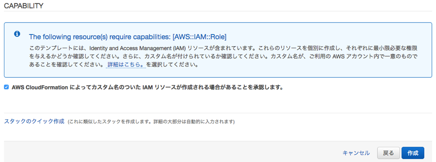

# モジュール 1: 環境構築と設定

最初のモジュールでは、検知と対応の統制の初期設定をします。2 つの CloudFormation テンプレートのうち、1つ目を実行して、これらの Control のいくつかの作成を自動化し、残りのものを手動で設定します。

## AWS CloudFormation テンプレートのデプロイ

シナリオを開始して環境を設定するには、モジュール 1 の CloudFormation テンプレートを実行する必要があります。

!!! info "Before you deploy the CloudFormation template feel free to view it <a href="https://github.com/aws-samples/aws-scaling-threat-detection-workshop/blob/master/templates/01-environment-setup.yml" target="_blank">here</a href>."

リージョン| デプロイ
------|-----
US West 2 (Oregon) | <a href="https://console.aws.amazon.com/cloudformation/home?region=us-west-2#/stacks/new?stackName=ThreatDetectionWksp-Env-Setup&templateURL=https://s3-us-west-2.amazonaws.com/sa-security-specialist-workshops-us-west-2/threat-detect-workshop/staging/01-environment-setup.yml" target="_blank"></a>

1. 上の **Deploy to AWS (AWS へのデプロイ)** ボタンをクリックします。これにより、テンプレートを実行するコンソールに自動的に移動します。

2. **Specify Details (詳細の指定)** セクションで、以下に示す必要なパラメータを入力します。

	| Parameter | Value  |
	|---|---|
	| Stack name | ThreatDetectionWksp-Env-Setup  |
	| Email Address | A ***valid*** email address  |
	
3. パラメータを入力したら、**Next (次)** をクリックし、もう一度 **Next (次)** をクリックします (このページの設定はデフォルトのままにします)。

4. 最後に、テンプレートによって IAM ロールが作成されることに確認し、**Create (作成)** をクリックします。



これによって CloudFormation コンソールに戻ります。ページを更新して、作成を開始するスタックを確認することができます。次に進む前に、スタックが以下に示すように **CREATE_COMPLETE** ステータスであることを確認します。


SNS から、サブスクリプションを確認するように依頼するメールが届きます。ワークショップ中に AWS のサービスからメールアラートを受信できるように、**サブスクリプションを確認します**。

!!! info "アラートメールの送信元は <no-reply@sns.amazonaws.com> になります。受信できない場合は、ご利用のメール環境でフォルダ振り分けがされていたり、SPAM判定をされていたりしないかご確認ください。" 

## Amazon CloudWatch イベントルールおよび自動応答の設定

先ほど実行した CloudFormation テンプレートによって、アラートおよび応答のための 3 つの <a href="https://docs.aws.amazon.com/AmazonCloudWatch/latest/events/WhatIsCloudWatchEvents.html" target="_blank">CloudWatch イベントルール</a> が作成されました。以下の手順で最終的なルールを作成します。この後、メール通知を受け取り、脅威に対応するために AWS Lambda 関数をトリガーするための必要なすべてのルールが設定されます。

以下は、コンソールを通じてこのルールを作成する手順ですが、<a href="http://docs.aws.amazon.com/guardduty/latest/ug/guardduty_findings_cloudwatch.html" target="_blank">Amazon GuardDuty ドキュメント</a>を確認することで、プログラムでルールを実行する方法についても詳しく知ることができます

1.	<a href="https://us-west-2.console.aws.amazon.com/cloudwatch/home?region=us-west-2" target="_blank">CloudWatch コンソール</a> (us-west-2) を開きます。
2.	左のナビゲーションペインで、**Events (イベント)** の下の **Rules (ルール)** をクリックします。

	!!! question "現在のルールは何を実行するように設定されていますか?"
	
3.	**Create Rule (ルールの作成)** をクリックします。

4.	**Event Pattern (イベントパターン)** の下で、**Build event pattern to match events by service (サービス別のイベントに一致するイベントパターンの構築)** をクリックし、ドロップダウンの **Custom event pattern (カスタムイベントパターン)** を選択します。以下のカスタムイベントパターンを貼り付けます。
	
```json
{
  "source": [
	"aws.guardduty"
  ],
  "detail": {
	"type": [
	  "UnauthorizedAccess:EC2/MaliciousIPCaller.Custom"
	]
  }
}
```
ターゲットについては、**Add Target (ターゲットの追加)** をクリックし、**Lambda Function (Lambda 関数)** を選択してから **threat-detection-wksp-remediation-nacl** を選択します。**Configure details (詳細の構成)** をクリックします。

5.	**Configure rule details (ルールの詳細の構成)** 画面で、**Name (名前)** および **Description (説明)** を入力します (以下を参照)。
    * Name (名前): **threat-detection-wksp-guardduty-finding-ec2-maliciousip**
    * Description (説明): **GuardDuty の検出結果: UnauthorizedAccess:EC2/MaliciousIPCaller.Custom**
6.  **Create rule (ルールの作成)** をクリックします。
7.	**オプション:** Lambda関数が何をしているのかを見てみましょう。Open the <a href="https://us-west-2.console.aws.amazon.com/lambda/home?region=us-west-2" target="_blank">Lambda コンソール</a>を開きます. **threat-detection-wksp-remediation-nacl** という名前の関数をクリックします。

    !!! question "この関数は何を行う関数ですか?"

    !!! question "Threat-detection-wksp-remediation-inspector 関数は何を行いますか?"

## Amazon GuardDuty の有効化

The next step is to enable Amazon GuardDuty, which will continuously monitor your environment for malicious or unauthorized behavior.

1.	Go to the <a href="https://us-west-2.console.aws.amazon.com/guardduty/home?region=us-west-2" target="_blank">Amazon GuardDuty</a> console (us-west-2).

2.	Click the **Get Started** button.

3.	On the next screen click the **Enable GuardDuty** button.

GuardDuty is now enabled and continuously monitoring your CloudTrail logs, VPC flow logs, and DNS Query logs for threats in your environment.

## Enable Amazon Macie

Since you plan on storing sensitive data in S3, let’s quickly enable Amazon Macie.  Macie is a security service that will continuously monitor data access activity for anomalies and generate alerts when it detects risk of unauthorized access or inadvertent data leaks.

1.	Go to the <a href="https://us-west-2.redirection.macie.aws.amazon.com/" target="_blank">Amazon Macie</a> console (us-west-2).

2.	Click **Get Started**.

3.	Macie will create a service-linked role when you enable it. If you would like to see the permissions that the role will have you can click the **View service role permissions**.

4.	Click **Enable Macie**.

## Setup Amazon Macie for data discovery & classification

Macie is also used for automatically discovering and classifying sensitive data.  Now that Macie is enabled, setup an integration to classify data in your S3 bucket.

1.	In the Amazon Macie console click on **Integrations** on the left navigation.

3.	Find your AWS account ID (there should be only one) and click **Select** 

4.	Click **Add** then on the next screen click the check box next to the S3 bucket that ends with **“-data”**. Click **Add**

5. Leave the options here at the default, click **Review**.

6. On the next screen click **Start Classification**. 

6. Finally click **Done**. Macie is now enabled and has begun to discover, classify and protect your data.

## Enable AWS Security Hub

Now that all of your detective controls have been configured you need to enable <a href="https://aws.amazon.com/security-hub/" target="_blank">AWS Security Hub</a>, which will provide you with a comprehensive view of the security and compliance of your AWS environment.

1.	Go to the <a href="https://us-west-2.console.aws.amazon.com/securityhub/home?region=us-west-2#" target="_blank">AWS Security Hub</a> console.

2.	Click the **Enable Security Hub** button.

3.	On the next screen click the **Enable AWS Security Hub** button.

AWS Security Hub is now enabled and will begin collecting and aggregating findings from the security services we have enabled so far.

## Architecture overview

Your environment is now configured and ready for operations.  Below is a diagram to depict the detective controls you now have in place.


After you have successfully setup your environment, you can proceed to the next module.
