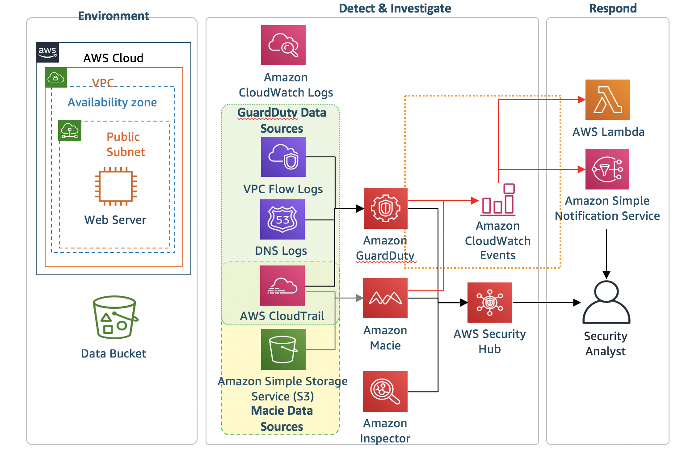

# モジュール 2: 攻撃シミュレーション

検知と対応の統制の設定が完了したので、もう 1 つの CloudFormation テンプレートを実行します。このテンプレートは、実際の攻撃をシミュレートします。

**アジェンダ**

1.  つ目の CloudFormation テンプレートの実行 – 5 分
2.  脅威検知と対応のプレゼンテーション – 25 分

## CloudFormation テンプレートのデプロイ

攻撃シミュレーションを開始するには、モジュール 2 の CloudFormation テンプレートを実行する必要があります。

!!! info "CloudFormation Template実行する前に <a href="https://github.com/aws-samples/aws-scaling-threat-detection-workshop/blob/master/templates/02-attack-simulation-nom.yml" target="_blank">こちら</a href> もご確認ください"

リージョン| デプロイ
------|-----
US West 2 (Oregon) |  

1.  上の **Deploy to AWS (AWS へのデプロイ)** ボタンをクリックします。これにより、テンプレートを実行するコンソールに自動的に移動します。   

2.  スタックの名前は自動的に移入されますが、自由に変更できます。その後、**Next (次)** をクリックしてからもう一度 **Next (次)** をクリックします (このページの設定はデフォルトのままにします)。  

3.  最後に、テンプレートによって IAM ロールが作成されることに同意し、**Create (作成)** をクリックします。

これによって CloudFormation コンソールに戻ります。ページを更新して、作成を開始するスタックを確認することができます。先に進む前に、スタックが以下に示すように **CREATE_COMPLETE** ステータスであることを確認します。

## 脅威検知と対応のプレゼンテーション

以下は、モジュール 2 の CloudFormation スタックが作成された後の設定の図です。

!!! warning "脅威検知と対応のプレゼンテーション"
    **AWS Sponsored Event**: クラスルームトレーニングでこのワークショップを行う場合、プレゼンテーションが終わるまで待ってからモジュール 3 を開始してください (攻撃シナリオが完了するように、プレゼンテーションには十分な時間が割り当てられます。)

    **Individual**: クラスルームトレーニング以外でこのワークショップを行う場合は、モジュール 3 に進むことができます。2 つ目の CloudFormation テンプレートが完了してから検出結果の表示が始まるまで、少なくとも 20 分かかることに注意してください。
