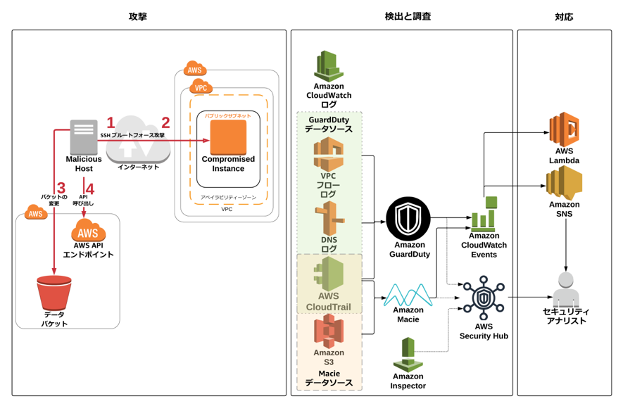

<!--
Outline for 03-detection-and-remediation.md
# Module 3: Detect, Investigate & Respond

## Part 1 - Compromised AWS IAM credentials
### Detect and Investigate
#### Explore findings related to the access key (securityhub)
### Respond
#### Revoke the IAM role sessions (IAM)
#### Restart instance to rotate access keys (EC2)
#### Verify the the access keys have been rotated (Systems Manager)

## Part 2 - Compromised EC2 Instance
### Detect and Investigate
#### Explore findings related to the instance ID (securityhub)
#### Determine if ssh password authentication is enabled (securityhub)
#### Determine if the attacker was able to login to the EC2 instance (CloudWatch logs)
### Respond
#### Modify the EC2 security group (EC2)

## Part 3 - Compromised S3 security
### Detect and Investigate
#### Investigate any S3 related findings (securityhub)
#### Check if sensitive data was involved (Macie)
### Respond
#### Fix the S3 data bucket permissions and encryption (S3)

# Link to next module
-->

# モジュール 3: 検知、調査、および対応

残念ながら、環境の構成が適切でないため、攻撃者がウェブサーバーにアクセスできた可能性があります。設定したセキュリティサービスから、悪意のあるアクティビティを示すアラートを受け取っています。これらのアラートには、既知の悪意のある IP アドレスとのコミュニケーション、アカウント偵察、Amazon S3 バケット設定の変更、およびセキュリティ設定の無効化が含まれます。侵入者のアクセスをブロックして、脆弱性を修復し、構成を適切な状態に復元するために、侵入者がどのアクティビティを実行した可能性があるか、どのような方法で実行したかを明確にする必要があります。

## 第 1 部 -  AWS IAM 認証情報の侵害

### 検知および調査

有効にしたセキュリティサービスからメールアラートを受け取りました。どうしたらよいでしょうか? あなたの組織では、リスク駆動型の検知戦略の一環で、AWS IAM 関連の検出結果を優先することにしました。

1.  メールアラートを分類し、AWS IAM プリンシパルに関連するアラート (たとえば、Amazon GuardDuty 検出結果: UnauthorizedAccess:IAMUser/MaliciousIPCaller.Custom) を特定します。
2.  メールアラートから **`Access Key ID`** をコピーします。

**アクセスキーに関連する検出結果を調べます (Amazon GuardDuty)**

手掛かりとなるリソース識別子から、Amazon GuardDuty を使用して検出結果の調査を開始します。

1.  <a href="https://us-west-2.console.aws.amazon.com/guardduty/" target="_blank">Amazon GuardDuty</a> コンソール (us-west-2) に移動します。

2.  **Add filter criteria (フィルタ基準の追加)** ボックスをクリックします。 **Access Key ID (アクセスキー ID)** を選択し、メールからコピーした <Access Key ID> を貼り付けます。

    !!! question "このアクセスキー ID に関連してどのような検出結果がありますか?"

3.  検出結果のいずれかをクリックし、詳細を確認します。

	!!! question "これらの認証情報はどこからのものですか?"

**Resource affected (影響のあるリソース)** の下の **User type (ユーザータイプ)** を調べると、この検出結果で参照されているアクセスキーが IAM 引き受けロール(assumed role)からであるとわかります。**Resource affected (影響のあるリソース)** の下の**Principal ID (プリンシパル ID)** を調べると、コロンで区切られた 2 つの文字列を確認できます。最初の文字列は IAM ロールの <a href="https://docs.aws.amazon.com/IAM/latest/UserGuide/reference_identifiers.html#identifiers-unique-ids" target="_blank">一意の ID</a> で、2 つ目の文字列は EC2 インスタンス ID です。**Principal ID (プリンシパル ID)** には、API リクエストを行ったエンティティの一意の ID が含まれ、一時セキュリティ認証情報を使用してリクエストを行った場合 (引き受けロール呼び出しの場合)、セッション名も含まれます。この場合、EC2 の .IAM ロールを使用して引き受けロール呼び出しが行われたため、セッション名は EC2 インスタンス ID となります。

5.  ロールの一意の ID とセッション名の両方を含む完全な **Principal Id (プリンシパル ID)** をコピーします。 **"principalId": "`< unique ID >:< session name >`"**

6.  **Resource affected (影響のあるリソース)** の下の**User name (ユーザー名)** を調べます。API 呼び出しを行うために使用された一時認証情報が、IAM ロールがアタッチされた EC2 インスタンスからであるため、このユーザー名は、関係する IAM ロールの名前に対応します。

<!--

To use SH for this we could use the insight "AWS users with the most suspicious activity" but that would be a stretch - no way to take this and figure out an IAM role is involved just by using the SH console.


1. Go to the [AWS Security Hub](https://us-west-2.console.aws.amazon.com/securityhub/home?region=us-west-2#/investigate) console.
2. The link should take you to the **Investigate** section but if not, click on **Investigate** in the navigation on the left.
3. Click in the **Add filter** box:

	* Scroll down to **Resource ID**, change the operator to **CONTAINS** and paste in the `<Access Key ID>` you copied from the e-mail.

	>  What findings do you see related to this access key ID?

4. Click on one of the findings to see the details.

	> Where did these credentials come from?

Examining **userType** under **Resource details**/**Details** you can see that the access key referenced in this finding is from an IAM assumed role. Examining **principalID** under **Details** you will find two strings separated by a colon. The first is the [unique ID](https://docs.aws.amazon.com/IAM/latest/UserGuide/reference_identifiers.html#identifiers-unique-ids) for the role and the second is the EC2 instance ID. The **principalID** contains a unique ID for the entity making the API request, and when the request is made using temporary security credentials (which is what happens for an assume role call) it also includes a session name. In this case the session name is the EC2 instance ID  since the assume role call was done using an IAM role for EC2.

5. Copy the full **principalId** which contains both the unique ID of the role and the session name
	* **"principalId": "`< unique ID >:< session name >`"**

6. Click **Cancel** (upper right-hand corner) to return back to the findings and paste only the **unique ID** into the filter:
	* **Keyword: `<unique ID>`**

Filtering on the access key ID like you did previously earlier will only show you findings related to that specific access key.  In this case the access key is from an assumed role call which means it will change over time.  Rather than using the access key id you can filter on the unique ID for the AWS IAM role which will show you all findings related to any access keys generated by that AWS IAM role.

7. After you have applied the filter check all the checkboxes for the findings, click **Actions**, and set active status to **In Progress** (since we are actively investigating this.)

8. Click **Create Insight** so you can further track findings related to this IAM principal.  Enter the following into insight name **`Show me findings related to <Unique ID>`** and toggle the **Display on insights page** so it is enabled and click **Ok**

-->

### 対応

EC2 の IAM ロールからの一時セキュリティ認証情報を攻撃者が使用していることが明確になったので、権限がこれ以上悪用されたり昇格されたりする可能性を防ぐために、直ちに認証情報をローテーションすることにしました。

**IAM ロールセッションの取り消し (IAM)**

1.  <a href="https://console.aws.amazon.com/iam/home?region=us-west-2" target="_blank">AWS IAM</a> コンソールを参照します。

2.  **Roles (ロール)** をクリックし、前のセクションで特定したロールを見つけます (これは、乗っ取られたインスタンスにアタッチされたロールです)。

3.  **Revoke sessions (セッションの無効化)** タブをクリックします。

4.  **Revoke active sessions (アクティブなセッションの無効化)** をクリックします。

5.  確認のチェックボックスをクリックし、**Revoke active sessions (アクティブなセッションの無効化)** をクリックします。

    !!! question "このロールによって発行された一時セキュリティ認証情報の使用を実際に防ぐために、どのような仕組みがこのステップで設定されますか?"

**EC2 インスタンスを再起動してアクセスキーをローテート(EC2)**

侵害された IAM ロールのアクティブな認証情報がすべて無効になりました。つまり、攻撃者はこれらのアクセスキーを使用できなくなりましたが、このロールを使用するアプリケーションも同様にアクセスキーを使用できなくなりました。あなたはこれを知っていましたが、侵害された IAM アクセスキーのリスクが高かったため、必要な措置であると判断しました。アプリケーションの可用性を確実にするために、インスタンスを停止してから起動して、インスタンスのアクセスキーをリフレッシュする必要があります。単純なリブートではキーは変更されません。待つことでもインスタンスの一時セキュリティ認証情報がリフレッシュされますが、この手順によって処理は高速化されます。EC2 インスタンスの管理を実行するために AWS Systems Manager を使用しているので、これを使用してメタデータのクエリを実行し、ローテーション後にアクセスキーがローテーションされたことを検証できます。

1.  <a href="https://us-west-2.console.aws.amazon.com/ec2/v2/home?region=us-west-2#Instances:sort=instanceId" target="_blank">EC2 コンソール</a> で threat-detection-wksp: Compromised Instance という名前のインスタンスを **Stop (停止)** します。

2.  **Instance State (インスタンスの状態)** の下でインスタンスの状態が **stopped (停止済み)** になるまで待ってから (EC2 コンソールのリフレッシュが必要な場合あり)、インスタンスを **Start (起動)** します。

    !!! info "ここで次の作業の前にすべてのステータスチェックを待つ必要があります。"

**アクセスキーのローテートを確認 (Systems Manager)**

1.  <a href="https://us-west-2.console.aws.amazon.com/systems-manager/managed-instances?region=us-west-2" target="_blank">AWS Systems Manager</a> コンソールに移動し、左のナビゲーションにある **Session Manager (セッションマネージャー)** をクリックし、[Start Session (セッションの開始)] をクリックします。

    **Instance state (インスタンスの状態)** が **running (実行中)** の **threat-detection-wksp: Compromised Instance** というインスタンスが表示されます。

2.  インスタンスで現在アクティブな認証情報を確認するには、threat-detection-wksp: Compromised Instance の横にあるラジオボタンをクリックして、**Start Session (セッションの開始)** をクリックします。

3.  シェルで次のコマンドを実行します。

``` bash
curl http://169.254.169.254/latest/meta-data/iam/security-credentials/threat-detection-wksp-compromised-ec2
```

!!! question "このシナリオが、Auto Scaling グループ に対してよいユースケースであるのはなぜですか?"

この時点で、AWS IAM ロールのすべてのアクティブなセッションが正常に取り消され、EC2 インスタンスの一時セキュリティ認証情報をローテーションされました。

<!--
, and created an AWS Security Hub insight to allow you to continue to track findings related to the role.  You can view the insight you created by clicking on **Security Hub default** in the AWS Security Hub console.
-->

## 第 2 部 - 侵害された EC2 インスタンス

### 検知および調査

侵害された IAM 認証情報に対処したので、今度は攻撃者が EC2 インスタンスにどのように侵入したかに焦点を置く必要があります。この侵入により、攻撃者はインスタンスメタデータのクエリを実行し、認証情報を盗むことができました。

**インスタンス ID に関連する検出結果を調べます (AWS Security Hub)**

侵害された IAM 認証情報を調査して、それが EC2 の IAM ロールからであることがわかり、検出結果のプリンシパル ID から EC2 インスタンス ID を特定しました。このインスタンス ID を使用して、AWS Security Hub で検出結果の調査を開始できます。まず、EC2 インスタンスに関連する GuardDuty の検出結果を調査します。

1. <a href="https://us-west-2.console.aws.amazon.com/securityhub/home?region=us-west-2#/findings" target="_blank">AWS Security Hub</a> コンソールに移動します。
2.  リンクにより **Findings (検出結果)** セクションに移動しますが、移動しなかった場合は左のナビゲーションの **Findings (検出結果)** をクリックします。
3.  **Add filter (フィルタの追加)** ボックスをクリックします。

	* **Resource ID (リソース ID)** にスクロールダウンし、演算子を **CONTAINS (含む)** に変更し、(GuardDuty の検出結果で収集したプリンシパル ID から) 前にコピーした <Instance ID> を貼り付けます。
	* **Add filter (フィルタの追加)** ボックスをもう一度クリックして別のフィルタを追加し、**Product Name (製品名)** にスクロールダウンして GuardDuty と入力します。

	!!! question "このインスタンス ID に関連してどのような検出結果がありますか?"

<!--
1. Go to the [AWS Security Hub](https://us-west-2.console.aws.amazon.com/securityhub/home?region=us-west-2) console.
2. On the left navigation, click on **Explore Findings**
3. Add the following filter:
	* **Keyword: `instance id`** (you obtained the instance ID earlier from the principal ID in one of the findings. The instance ID came from the session name of the principal ID.)
	* **Provider: GuardDuty**

	>  What findings do you see related to this Instance ID?
-->

検出結果の 1 つで、EC2 インスタンスが脅威リスト (**disallowed IP (許可されない IP)**) にある IP アドレスと通信していることが示され、インスタンスが侵害されたという結論が一層確かになります。他の検出結果では、特定の IP アドレスのシステムがインスタンスに対して SSH ブルートフォース攻撃を実行していることが示されています。今度は、SSH ブルートフォース攻撃が成功したかどうか、それによって攻撃者がインスタンスへのアクセスを取得できたかどうかを調査する必要があります。

**ssh パスワード認証が EC2 インスタンスで有効かどうかを確認 (AWS Security Hub)**

脅威に対する対応は、多くのことを自動化できます。たとえば、脅威に関する情報の収集に役立つトリガーを設定し、それをセキュリティチームが調査に使用することができます。そのオプションを考慮して、GuardDuty が特定の攻撃を検出したときに EC2 インスタンスの <a href="https://aws.amazon.com/inspector/" target="_blank">Amazon Inspector</a> スキャンをトリガーする CloudWatch イベントルールがあります。AWS Security Hub を使用して Inspector からの検出結果を表示します。SSH の構成がベストプラクティスに従っているかどうかを確認します。  

1.  <a href="https://us-west-2.console.aws.amazon.com/securityhub/home?region=us-west-2#/findings" target="_blank">AWS Security Hub</a> コンソールに移動します。
2.  リンクにより **Findings (検出結果)** セクションに移動しますが、移動しなかった場合は左のナビゲーションの **Findings (検出結果)** をクリックします。**Add filter (フィルタの追加)** ボックスをクリックします。

	* **Title (タイトル)** にスクロールダウンし、演算子を **CONTAINS (含む)** に変更し、`password authentication over SSH`.

SSH に関連する検出結果、および SSH ブルートフォース攻撃を受けたインスタンスのパスワード認証に関連する検出結果があります。

<!--
1. Go to [AWS Security Hub](https://us-west-2.console.aws.amazon.com/securityhub/) in the AWS Management Console.
2. On the left navigation, click on **Explore Findings**
3. Add the following filter:
	* **Keyword: `password authentication over SSH`**
	* **Provider: Inspector**
4. In the results do you see a finding regarding SSH and password authentication for the instance that experienced the SSH brute force attack?
-->

!!! info "しばらくしても検出結果が表示されない場合、Inspector エージェントに問題がある可能性があります。<a href="https://us-west-2.console.aws.amazon.com/inspector" target="_blank">Inspector</a> コンソールに移動し、[Assessment Templates (評価テンプレート)],をクリックし、threat-detection-wksp で始まるテンプレートを選択して [Run (実行)] をクリックします。スキャンが完了するまで 15 分 待ってください。また、[Assessment runs (評価実行)] を調べて [status (ステータス)] をチェックすることもできます。このモジュールを続けて、後で結果を確認してください。"

検出結果に基づいて、インスタンスで SSH によるパスワード認証が構成されていることがわかります。さらに、Inspector の他の検出結果をいくつか調べると、パスワードの複雑さの制限がないことがわかります。これは、インスタンスが SSH ブルートフォース攻撃を受けやすいことを意味します。

<!--
2.  Click on **securityhub default** under **Insight Groups**
3. Click **Manage** (in the upper right hand corner of the dashboard) and then click **Define Insight**
4.  We will now define the filters for the insight. Under "Findings" select **Provider** from the pull down menu. Next to that select **Inspector**. This will add **Provider: Inspector** to the filters. Next select **Keyword** from the pull down menu under findings (it should already be the default.) Next to that enter the following text `password authentication over SSH` then hit enter. You will have added a keyword filter.
5. Click **Create insight** so we can save this insight for future use. Enter the following into insight name **`Instances allowing password authentication over SSH`** and toggle the **Display on insights page** so it is enabled then finally click **Ok**.
-->

**攻撃者が EC2 インスタンスにログインできたかどうか判断 (CloudWatch ログ)**

インスタンスが SSH ブルートフォース攻撃を受けやすいことがわかったので、CloudWatch ログを調べて、SSH ログインが成功したかどうか(最終的にSSH ブルートフォース攻撃が成功したかどうか)を確認するためのメトリクスを作成しましょう。企業のポリシーで、EC2 インスタンスから CloudWatch に特定のセキュリティログを送信しています。

1.  <a href="https://us-west-2.console.aws.amazon.com/cloudwatch/home?region=us-west-2#logs:" target="_blank">CloudWatch ログ</a> に移動します。
2.  ロググループ **/threat-detection-wksp/var/log/secure** をクリックします。
3.  複数のログストリームがある場合、前にコピーしたインスタンス ID を使用してフィルタリングし、ストリームをクリックします。
4.  **Filter Events (イベントのフィルタ)** テキストボックスに、次のフィルタパターンを入力します。 **`[Mon, day, timestamp, ip, id, msg1= Invalid, msg2 = user, ...]`**

    !!! question "インスタンスへのログイン試行の失敗 (無効なユーザー) が表示されますか? それは SSH ブルートフォース攻撃と整合性がありますか?"

5.  ログインの成功を示すフィルタに置き換えます。 **`[Mon, day, timestamp, ip, id, msg1= Accepted, msg2 = password, ...]`**

    !!! question "インスタンスへのログイン試行の成功が表示されますか?"

    !!! question "どの linux ユーザーが侵害されましたか?"

### 対応

**EC2 セキュリティグループの変更 (EC2)**

攻撃者のアクティブなセッションは、インスタンスが存在するサブネットの NACL の更新によって自動的に停止されました。これは、特定の GuardDuty 検出結果に基づいて呼び出される CloudWatch イベントルールトリガーによって実行されました。次に行うべきステップは、EC2 インスタンスに関連するセキュリティグループを変更して、攻撃者または他のユーザーが異なるソース IP から接続しないようにすることです。

1.  <a href="https://us-west-2.console.aws.amazon.com/ec2/v2/home?region=us-west-2" target="_blank">Amazon EC2</a> コンソールに移動します。

2.  **threat-detection-wksp: Compromised Instance** という名前の実行中のインスタンスを見つけます。

3.  **Description (説明)** タブの下で、乗っ取られたインスタンスのセキュリティグループをクリックします。

4.  **Inbound (インバウンド)** タブの下のルールを表示します。

5.  **Edit (編集)** をクリックしてインバウンド SSH ルールを削除します。EC2 インスタンスのすべての管理を <a href="https://aws.amazon.com/systems-manager/" target="_blank">AWS Systems Manager</a> を通じて行うことにしたため、このポートはもうオープンにする必要がありません。

    !!! info "初期設定で、EC2 インスタンスに SSM エージェントをインストール済みです。"

6.  **Save (保存)** をクリックします。


## 第 3 部 – 侵害された S3 バケット

### 検知および調査

SSH ブルートフォース攻撃が成功したことがわかり、盗まれた IAM 認証情報を無効にしたので、次は何か別のことが発生したかどうかを明確にする必要があります。ここで実行できる 1 つのステップは、一時認証情報を生成した IAM ロールにアタッチされている IAM ポリシーを調べることです。ポリシーで、Amazon S3 サービスに関連するアクセス許可があることがわかるので、調査を続行するときにこのアクセス許可を心に留めておきます。

侵害されたEC2 インスタンスにアタッチされていた IAM ロールのポリシーの一部

```json
{
    "Version": "2012-10-17",
    "Statement": [
        {
            "Action": "s3:PutObject",
            "Resource": "arn:aws:s3:::threat-detection-wksp-ACCOUNT_ID-us-west-2-gd-threatlist/*",
            "Effect": "Allow"
        },
        {
            "Action": [
                "s3:*"
            ],
            "Resource": "arn:aws:s3:::threat-detection-wksp-ACCOUNT_ID-us-west-2-data/*",
            "Effect": "Allow"
        },
        {
            "Action": [
                "s3:*"
            ],
            "Resource": "arn:aws:s3:::threat-detection-wksp-ACCOUNT_ID-us-west-2-data",
            "Effect": "Allow"
        }
    ]
}
```

**S3 に関連する検出結果を調査 (AWS Security Hub)**

次のステップへのアプローチは何通りもあります。このような状況に役立つ可能性がある、Security Hub のインサイトから開始します。これが唯一の実行方法というわけではありませんが、攻撃の影響をまとめて調査して初動時間を節約できます。

1.  AWS マネジメントコンソールの <a href="https://us-west-2.console.aws.amazon.com/securityhub/home?region=us-west-2#/insights" target="_blank">AWS Security Hub</a> に移動します。
2.  リンクにより **Insights (インサイト)** セクションに移動しますが、移動しなかった場合は左のナビゲーションの **Insights (インサイト)** をクリックします。
3.  **Filter insights (インサイトのフィルタ)** ボックスをクリックし、組み込みインサイト **Top S3 buckets by counts of findings (検出結果数による上位の S3 バケット)** を表示する Top S3 と入力します。そのインサイトをクリックします。
4.  どのバケットが表示されますか? **threat-detection-wksp-** を含み **-data** で終了するバケットが表示されます。そのバケットをクリックします。
5.  検出結果には何が表示されますか?

この **Security Hub** のインサイトは、攻撃者が実行した可能性があることを明確にする 1 つの方法です。しかし、すべての状況で役に立つとは限りません。攻撃者が実行したことを調査するために行う他のステップには何がありますか?

**機密データが含まれているかどうかの確認 (Macie)**

ここまでで、攻撃者がシステムに侵入した方法と実行したことの概要がわかりました。前のステップで、**threat-detection-wksp-** で開始して **-data** で終了する S3 バケットに、グローバル読み取り権限を付与する ACL があることがわかりました。今度は、ビジネスにとって重要な機密データがいずれかのバケット (特にそのデータバケット) にあるかどうかを確認し、Macie アラートを詳しく調べます。

1.  AWS マネジメントコンソールの  <a href="https://mt.us-west-2.macie.aws.amazon.com/" target="_blank">Amazon Macie</a> に移動します。

2.  最近のアラートを調べます。

    !!! question "クリティカルなアラートがありますか? これは Security Hub で見つけたものと一致しますか?"

    次は、どのような種類の機密データがそのバケットに存在するか確認しましょう。

3.  左のナビゲーションの **Dashboard (ダッシュボード)** をクリックします。次のデータ分類が表示されます。
    

    !!! info "リスクスライダーをスライドして、リスクレベルに基づいてデータ分類をフィルタできます。"

4.  リスクスライダーの上の **S3 public objects and buckets (S3 パブリックオブジェクトとバケット)** のアイコンをクリックします。アイコンは地球の形ですが、アイコンの上にマウスを重ねて正しいアイコンを見つけることもできます。
    

5.  リストされたバケット名の左にある拡大鏡をクリックします。

6.  バケットのいずれかのデータが高リスクであると見なされるかどうかを確認します。  **Object PII priority (オブジェクト PII 優先度)** フィールドおよび **Object risk level (オブジェクトリスクレベル)** フィールドを探します。

7.  7.	データのいずれかが暗号化を解除されているかどうかを確認します。

    !!! question "**Object encryption (オブジェクト暗号化)** フィールドを探します。(青い棒の一部は暗号化がなしに設定されていることを示しますか?)"

### 対応

**バケットのアクセス許可および暗号化を修正 (S3)**

前のステップで、**threat-detection-wksp-** で開始して **-data** で終了する S3 バケットに機密データがあり、そのデータの一部が暗号化されていないことがわかりました。バケットがグローバル読み取り権限を付与することもわかりました。これらの問題を手動で修正する必要があります。  

1.  AWS マネジメントコンソールの <a href="https://us-west-2.console.aws.amazon.com/s3/" target="_blank">Amazon S3</a> に移動します。

    まず、アクセス許可を修正します。
2.  **threat-detection-wksp-** で開始し **-data** で終了するバケットを見つけます。
3.  **Permissions (アクセス許可)** タブをクリックしてから **ACL Control List (ACL コントロールリスト)** をクリックします。
4.  **Public access (パブリックアクセス)** の下で、**Everyone (すべてのユーザー)** の横にあるラジオボタンをクリックします。**List objects (リストオブジェクト)** の選択を解除して **Save (保存)** をクリックします。

    次は暗号化を修正する必要があります。
5.  同じバケットで **Properties (プロパティ)** タブをクリックして **Default encryption (デフォルトの暗号化)** をクリックします。
6.  暗号化を AWS-KMS に設定します。**aws/s3** キーを選択します。最後に **Save (保存)** をクリックします。

    !!! info "**Default encryption (デフォルトの暗号化)** を有効にすることによってバケット内の既存のオブジェクトにどのような影響を与えたかわかりますか?"

おめでとうございます! インシデントを正常に修復し、環境をさらに堅牢にできました。これは言うまでもなくシミュレーションであり、短い時間内に対応機能のすべての側面を説明することはできませんが、脅威および攻撃を検知、調査、対応するために AWS で利用できる機能についてアイディアを提示できたと思います。

---

あなたが調査してきた攻撃の図を次に示します。数字の 1 と 2 は、SSH ブルートフォース攻撃と SSH ログインの成功を示してします。3 は、攻撃者が加えた S3 バケットの変更を示します。4 は、乗っ取られた EC2 インスタンスから盗まれた IAM 一時認証情報を使用して、攻撃者が実行した API 呼び出しを示します


!!! warning "クラスルームトレーニングでこのワークショップを実行している場合、インストラクターがモジュール 4 のプレゼンテーションをすぐに開始します。"
