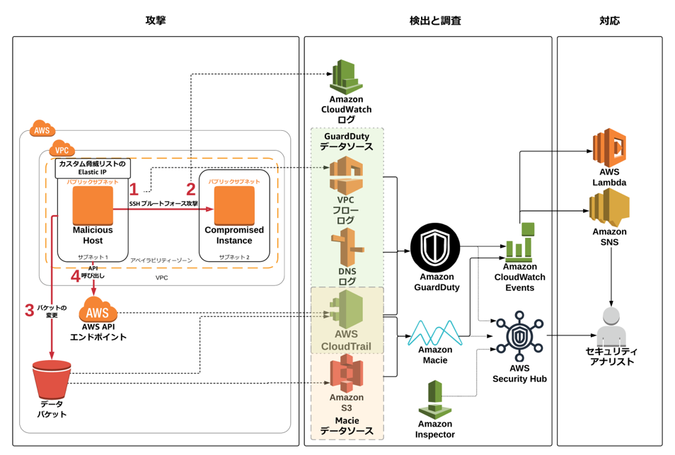

# モジュール 4: レビューとディスカッション

最後のモジュールでは、ワークショップについて簡単に説明します（また、何が起こったのかを正確に議論します）。また、いくつかの質問に答え、ワークショップ環境をクリーンアップする方法も説明します (AWS アカウントが今後請求されないようにします)。

**アジェンダ**

1.  レビューとディスカッション – 10 分
2.  質問 – 10 分
3.  クリーンアップ – 5 分

## アーキテクチャの概要
ワークショップ全体の設定の図: 

## 何が起こっていたのか

ワークショップの**モジュール 1** で、GuardDuty、Macie および簡単な通知と修復パイプラインを含むインフラストラクチャの初期設定をしました。一部の手順では手動の設定が必要でしたが、いくつかの構成要素を設定する CloudFormation テンプレートも実行しました。**モジュール 2** では、2 つ目の CloudFormation テンプレートを使って攻撃をシミュレートしました。2 つの EC2 インスタンスが作成し、1 つのインスタンス (**Malicious Host**) には EIP がアタッチされており、GuardDuty カスタム脅威リストに追加されています。**Malicious Host** は他のインスタンスと同じ VPC に存在しますが、シナリオの都合上 (さらに、侵入テストリクエストを送信しなくてもすむように)、インターネット上にあるかのように動作し、攻撃用のコンピュータを役割をしてしました。もう 1 つのインスタンス (**Compromised Instance**) はウェブサーバーであり、**Malicious Host** によって乗っ取られました。**モジュール 3** では、攻撃を調査し、破損を修復し、将来の攻撃に備えていくつかの自動修復を設定しました。   

**攻撃時に何が起きたか**

1.  モジュール 2 の CloudFormation テンプレートによって 2 つのインスタンスが作成されました。それらのインスタンスは同じ VPC 内の別のサブネットにあります。**Malicious Host** は攻撃者を表し、インターネットに存在するものとしています。**Malicious Host** の Elastic IP は、GuardDuty のカスタム脅威リストにあります。もう 1 つのインスタンスは **Compromised Instance** という名前で、AWS にリフトアンドシフトされたウェブサーバーを表しています。

2.  会社のポリシーでは、SSHは鍵ベースの認証だけを有効にする必要がありましたが、ある時点で SSH のパスワード認証が **Compromised Instance** で有効になりました。 

    !!! info "この誤った設定は、GuardDuty の検出結果からトリガーされた Inspector スキャンによって特定されます。"

3.  **Malicious Host** が、**Compromised Instance** に対してブルートフォース SSH パスワード攻撃を実行しました。ブルートフォース攻撃は成功するように設計されています。
	
	!!! info "**GuardDuty の検出結果**: UnauthorizedAccess:EC2/SSHBruteForce"

4.  SSH ブルートフォース攻撃が成功し、攻撃者が **Compromised Instance** にログインできました。
	
	!!! info "ログインの成功は CloudWatch ログ (/threat-detection-wksp/var/log/secure) によって確認できます。"

5.  モジュール 2 の CloudFormation テンプレートによって作成された EC2 インスタンスは、**データ**バケットのデフォルトの暗号化が無効にしました。さらに CloudFormation テンプレートによって**データ**バケットが外部公開されました。これは、モジュール 3 の調査の Macie の部分によって使用されます。攻撃者がバケットを公開し、バケットのデフォルトの暗号化設定を解除したようです。
	
	!!! info "Macie アラート: S3 バケット IAM ポリシーはグローバル読み取り権限を付与します。"

6.  Compromised Instance には、Malicious Host を継続的に ping する cron ジョブがあり、カスタム脅威リストに基づいて GuardDuty 検出結果を生成します。
	
	!!! info "**GuardDuty の検出結果**: UnauthorizedAccess:EC2/MaliciousIPCaller.Custom"

7.  API 関連の検出結果を生成した API 呼び出しは、**Malicious Host** からのものです。この呼び出しでは、**Malicious Host** で実行されている EC2 の IAM ロールからの一時認証情報が使用されています。**Malicious Host** にアタッチされた EIP がカスタム脅威リストにあるため、GuardDuty の検出結果が生成されます。  
	
	!!! info "**GuardDuty の検出結果**: Recon:IAMUser/MaliciousIPCaller.Custom"

    !!! info "**GuardDuty の検出結果**: UnauthorizedAccess:IAMUser/MaliciousIPCaller.Custom"

8.  GuardDuty の検出結果によっていくつかの CloudWatch イベントルールが呼び出され、これらのルールによって様々なサービスがトリガーされます。
	1.	**CloudWatch イベントルール**: 一般的な GuardDuty 検出結果によって、SNS によるメールの送信がトリガーされる CloudWatch イベントルールが呼び出されます。
	2.	**CloudWatch イベントルール**: 一般的な Macie アラートによって、SNS によるメールの送信がトリガーされる CloudWatch イベントルールが呼び出されます。
	3.	**CloudWatch イベントルール**: SSH ブルートフォース攻撃の検出結果によって、NACL を介して攻撃者の IP アドレスをブロックする Lambda 関数、および EC2 インスタンスで Inspector スキャンを実行する Lambda 関数をトリガーする CloudWatch イベントルールが呼び出されます。
	4.  **CloudWatch イベントルール**: Unauthorized Access Custom MaliciousIP の検出結果によって、NACL を介して攻撃者の IP アドレスをブロックする Lambda 関数をトリガーする CloudWatch イベントルールが呼び出されます。

## クリーンアップ
アカウントへの請求を防ぐために、作成したインフラストラクチャをクリーンアップすることをお勧めします。ワークショップついてもう少し調べるためにそのままにしておく場合は、終了時に忘れずにクリーンアップしてください。AWS アカウントで作成したものを実行中のまま忘れてしまうと、料金が発生します。  

!!! info "一部のリソースは CloudFormation スタックを削除する前に手動で削除する必要があるため、以下のステップを順番通りに実行してください。"

1.	ワークショップ用に作成された Inspector オブジェクトを削除します。
	* <a href="https://us-west-2.console.aws.amazon.com/inspector" target="_blank">Amazon Inspector</a> コンソールに移動します。
	* 左のナビゲーションペインの **Assessment targets (評価ターゲット)** をクリックします。
	* **threat-detection-wksp** で開始するものをすべて削除します。

2.	侵害された EC2 インスタンスの IAM ロールおよび Inspector の サービスリンクドロールを削除します (このロールをまだ作成していなかった場合)。
	* <a href="https://console.aws.amazon.com/iam/" target="_blank">AWS IAM</a> コンソールに移動します。
	* **Roles (ロール)** をクリックします。
	* **threat-detection-wksp-compromised-ec2** という名前のロールを探します。
	* このロールの横にあるチェックボックスをクリックし、**Delete(削除)** をクリックします。
	* **AWSServiceRoleForAmazonInspector** という名前のロールに対して、このステップを繰り返します。

3.	モジュール 1 の CloudFormation テンプレートによって作成された 3 つの S3 バケット (**threat-detection-wksp** で開始し、**-data**、**-threatlist**、および **-logs** で終了するバケット) をすべて削除します。
	* <a href="https://s3.console.aws.amazon.com/s3/home?region=us-west-2" target="_blank">Amazon S3</a> コンソールに移動します。
	* 適切なバケットをクリックします。
	* **Delete Bucket (バケットの削除)** をクリックします。
	* バケットの名前をコピーアンドペーストします (これは、そのバケットを本当に削除してよいかどうかの追加の確認です)。
	* 3 つのバケットすべてに対して前述のステップを繰り返します。

4.	4.	モジュール 1 および 2 の CloudFormation スタック (**ThreatDetectionWksp-Env-Setup** および **ThreatDetectionWksp-Attacks**) を削除します。
	* <a href="https://us-west-2.console.aws.amazon.com/cloudformation/home?region=us-west-2#/stacks?filter=active" target="_blank">AWS CloudFormation</a> コンソールに移動します。
	* 適切なスタックを選択します。
	* **Action (アクション)** を選択します。
	* **Delete Stack (スタックの削除)** をクリックします。
	* それぞれのスタックに対して前述のステップを繰り返します。

	!!! info "最初のスタックが削除されるのを待たずに 2 番目のスタックを削除できます。"

5.	GuardDuty カスタム脅威リストを削除し、GuardDuty を無効にします (ワークショップの前に GuardDuty をまだ有効にしていなかった場合)。
	* <a href="https://us-west-2.console.aws.amazon.com/guardduty/" target="_blank">Amazon GuardDuty</a> コンソールに移動します。
	* 左のナビゲーションの **Lists (リスト)** をクリックします。
	* **Custom-Threat-List** で開始する脅威リストの横にある **X** をクリックします。
	* 左のナビゲーションにあるナビゲーションペインの **Settings (設定)** をクリックします。
	* **Disable (無効化)** の横にあるチェックボックスをクリックします。
	* **Save settings (設定の保存)** をクリックしてから、ポップアップボックスの **Disable (無効化)** をクリックします。

6.	AWS Security Hub を無効にします。
	* <a href="https://us-west-2.console.aws.amazon.com/securityhub/home?region=us-west-2#/findings" target="_blank">AWS Security Hub</a> コンソールに移動します。
	* 左のナビゲーションの **Settings (設定)** をクリックします。
	* 上のナビゲーションの **General (一般)** をクリックします。
	* **Disable AWS Security Hub (AWS Security Hub の無効化)** をクリックします。

7.	作成した手動の CloudWatch イベントルールと、生成された CloudWatch ログを削除します。
	* <a href="https://us-west-2.console.aws.amazon.com/cloudwatch" target="_blank">AWS CloudWatch</a> コンソールに移動します。
	* 左のナビゲーションペインの **Rules (ルール)** をクリックします。
	* **threat-detection-wksp-guardduty-finding-maliciousip** の横にあるラジオボタンをクリックします。
	* **Action (アクション)** を選択し、**Delete (削除)** をクリックします。
	* 左のナビゲーションペインの **Logs (ログ)** をクリックします。
	* **/aws/lambda/threat-detection-wksp-inspector-role-creation** の横にあるラジオボタンをクリックします。
	* **Action (アクション)** を選択し、**Delete log group (ロググループの削除)** をクリックしてから、ポップアップボックスの **Yes, Delete (はい、削除します)** をクリックします。
	* 以下に対して繰り返します。 
		* **/aws/lambda/threat-detection-wksp-remediation-inspector**
		* **/aws/lambda/threat-detection-wksp-remediation-nacl**
		* **/threat-detection-wksp/var/log/secure** 

8.	SNS トピックに登録したときに作成された SNS サブスクリプションを削除します。
	* <a href="https://us-west-2.console.aws.amazon.com/sns" target="_blank">AWS SNS</a> コンソールに移動します。
	* 左のナビゲーションの **Subscriptions (サブスクリプション)** をクリックします。
	* 自分のメールアドレスがエンドポイントとして表示されているサブスクリプションで、**Subscription ARN (サブスクリプション ARN)** に **threat-detection-wksp** が含まれているサブスクリプションについて、その横にあるチェックボックスを選択します。
	* **Action (アクション)** を選択し、**Delete subscriptions (サブスクリプションの削除)** をクリックします。

9.	Macie を無効にします (ワークショップの前に Macie を有効にしていなかった場合)。
	* <a href="https://mt.us-west-2.macie.aws.amazon.com/" target="_blank">Amazon Macie</a> コンソールに移動します。
	* 右上の角で、**Region (リージョン)** の左にある下向き矢印を選択し、**Macie General Settings (Macie 一般設定)** を選択します。
	* 2 つのボックスを選択し、**Disable Amazon Macie (Amazon Macie の無効化)** をクリックします。

## 完了です!

このワークショップを完了しました。おめでとうございます! ここはワークショップの永続的なサイトですので、好きなときにいつでも再度アクセスしてください。

